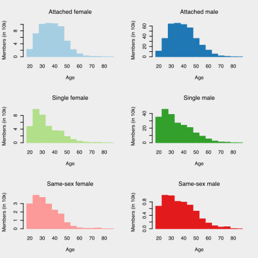
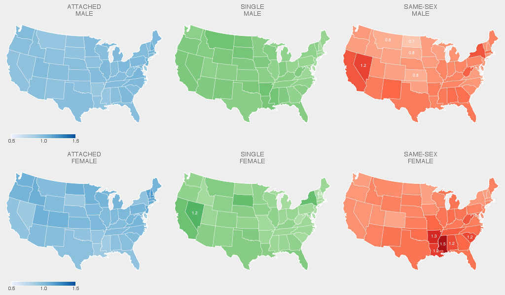
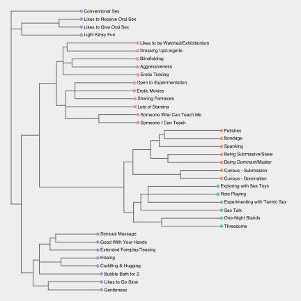
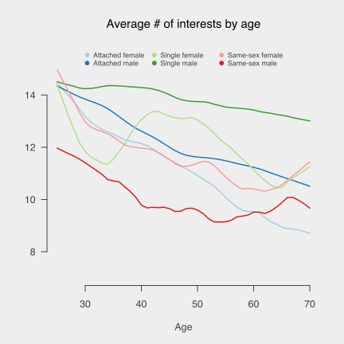
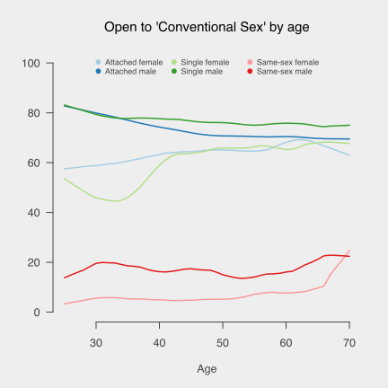
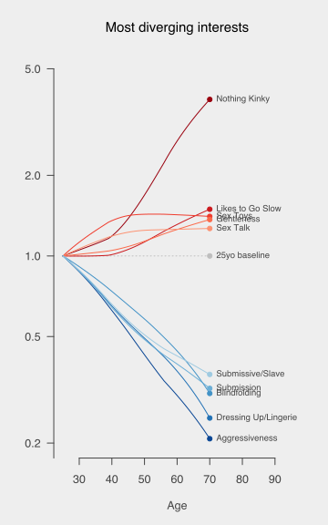

## Introduction

## Basic demographics

<figure class="left">

<figcaption>Attached members skew older.</figcaption>
</figure>

Lorem ipsum dolor sit amet, consectetur adipiscing elit. Maecenas tempus sit amet lorem vel bibendum. Vestibulum dui nisi, consectetur at mauris faucibus, condimentum maximus nunc. Maecenas dui mi, posuere et enim vel, iaculis ultricies massa. Phasellus at eros nibh. Donec viverra mauris pharetra egestas varius. Nullam id ligula diam. Donec volutpat sapien congue ullamcorper rutrum. Curabitur vel magna vitae sapien hendrerit pulvinar maximus vel mi.
Nam finibus fermentum venenatis. Fusce hendrerit gravida fermentum. Integer vestibulum lectus efficitur ligula pellentesque blandit. Integer fermentum pretium lacus lacinia luctus. Ut non ex et neque interdum aliquam. Aenean eu finibus nisi, ac cursus turpis. Proin facilisis lobortis tincidunt. Phasellus cursus ac risus non tincidunt. Suspendisse facilisis iaculis viverra. Donec ipsum elit, lacinia vitae ante sit amet, commodo ullamcorper ligula. Donec vitae venenatis ligula, non lacinia ante. Curabitur faucibus erat in odio ultricies maximus. Curabitur scelerisque sem sem, ut hendrerit nisl condimentum et. Proin ac ullamcorper sem. Integer a dui imperdiet, semper turpis nec, vehicula nunc.
Proin sodales non dolor id scelerisque. Maecenas laoreet porta ante eu fermentum. Pellentesque ac quam interdum, elementum nisl quis, laoreet purus. Fusce tempor lobortis sem ac lacinia. Vestibulum non rutrum augue, id finibus diam. Etiam sit amet tellus non elit maximus fringilla. Vestibulum faucibus mauris sem, non dictum ligula tempor eget. Sed ultricies blandit nunc, in placerat nisi vestibulum vel.

<figure class="full">

<figcaption>Same-sex members are overrepresented in the south-east.</figcaption>
</figure>

Lorem ipsum dolor sit amet, consectetur adipiscing elit. Maecenas tempus sit amet lorem vel bibendum. Vestibulum dui nisi, consectetur at mauris faucibus, condimentum maximus nunc. Maecenas dui mi, posuere et enim vel, iaculis ultricies massa. Phasellus at eros nibh. Donec viverra mauris pharetra egestas varius. Nullam id ligula diam. Donec volutpat sapien congue ullamcorper rutrum. Curabitur vel magna vitae sapien hendrerit pulvinar maximus vel mi.
Nam finibus fermentum venenatis. Fusce hendrerit gravida fermentum. Integer vestibulum lectus efficitur ligula pellentesque blandit. Integer fermentum pretium lacus lacinia luctus. Ut non ex et neque interdum aliquam. Aenean eu finibus nisi, ac cursus turpis. Proin facilisis lobortis tincidunt. Phasellus cursus ac risus non tincidunt. Suspendisse facilisis iaculis viverra. Donec ipsum elit, lacinia vitae ante sit amet, commodo ullamcorper ligula. Donec vitae venenatis ligula, non lacinia ante. Curabitur faucibus erat in odio ultricies maximus. Curabitur scelerisque sem sem, ut hendrerit nisl condimentum et. Proin ac ullamcorper sem. Integer a dui imperdiet, semper turpis nec, vehicula nunc.
Proin sodales non dolor id scelerisque. Maecenas laoreet porta ante eu fermentum. Pellentesque ac quam interdum, elementum nisl quis, laoreet purus. Fusce tempor lobortis sem ac lacinia. Vestibulum non rutrum augue, id finibus diam. Etiam sit amet tellus non elit maximus fringilla. Vestibulum faucibus mauris sem, non dictum ligula tempor eget. Sed ultricies blandit nunc, in placerat nisi vestibulum vel.

## Interests

<figure class="full">

<figcaption>Sexual interests clustered into major categories corresponding to: conventional (blue); experimentation (pink); bondage/fetish (orange); and other (green).</figcaption>
</figure>

## Interests by birth year/age

<figure class="right">

<figcaption>Number of sexual interests generally declines as function of year of birth.</ficaption>
</figure>

<figure class="left">

<figcaption>Interest in 'Conventional Sex' as function of age is inversely correlated between males (become less interested) and female (become more interested).</figcaption>
</figure>

<figure class="full">

<figcaption>Older members more interested in slow, conventional sex and less in BDSM and aggressiveness (compared to baseline 25yo member).
</figure>

## Interests by email domain

| Feature | Relative Rate | P-value |
| --- | --- | --- |
| **.gov** |
| A Don Juan | 7.4 | 4.7e-05 | 
| Slim to Average Body | 3.2 | 1.4e-06 | 
| Likes Routine | 3.2 | 6.9e-08 | 
| Likes to Receive Oral Sex | 0.7 | 1.1e-04 | 
| **.edu** |
| Muscular/Fit Body | 1.3 | 3.7e-10 | 
| Threesome | 1.2 | 4.8e-05 | 
| Facial Hair | 0.7 | 9.4e-07 | 
| Likes to Go Slow | 0.7 | 1.2e-04 | 
| **.mil** |
| Transvestitism | 4.7 | 1.9e-10 | 
| Has a Secret Love Nest | 4.2 | 2.7e-59 | 
| Tall Height | 4.1 | 4.8e-91 | 
| A Good Listener | 0.3 | 3.8e-06 | 
| **.fr** |
| Seeking a Sugar Daddy | 2.5 | 4.1e-09 | 
| Light Kinky Fun | 0.6 | 1.9e-07 | 
| **.uk** |
| Seeking a Sugar Daddy | 2.0 | 4.2e-08 | 
| Aggressiveness | 0.5 | 3.6e-11 | 

