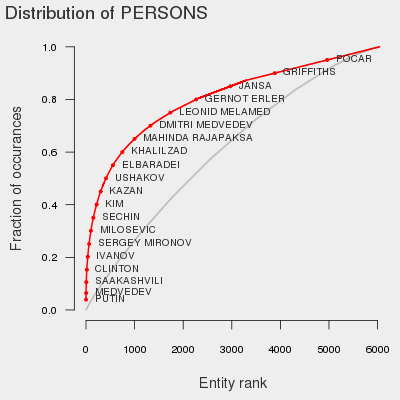
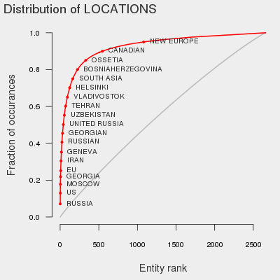
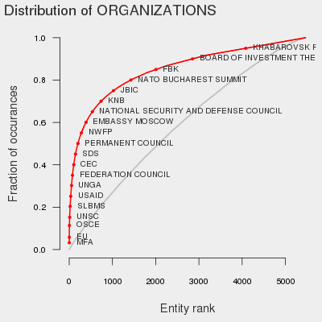

*Extracting important entities from the text is a useful first step and provides a birds-eye view of all the content. But what we're interested in is most likely at the margins.*

**Introduction**

The entire Cablegate release consists of over 250,000 cables from a 20 year period, over a gigabyte of full-text storage. To get a sense of the data, these initial analyses will focus on the 8,000 cables tagged "RS", corresponding to communication about Russia and neighbouring countries. Russia was chosen for several reasons:

* It's one of the single most-mentioned countries outside of the Middle East. At the same time, it appears to be strongly under-reported, as news agencies focused on cables relating to Iraq and Afghanistan or colourful personalities.
* It's an extremely important American adversary, with several major geo-political events (such as the Georgian War) occurring during the leaked time-frame. As a consequence, it features key players and organizations that are mostly well-known in the West.
* It's continued to engage in military activity that strongly mirrors the events of the Georgian War, and so there is hope that diplomatic communications from that time will inform our understanding of current events.

The first step in analysing so much text is breaking it down into major concepts and establishing their relationships. Concepts can be difficult to pin down, but the automated extraction of specific objects has been well-developed in the field of Natural Language Processing (NLP). Termed Named Entity Recognition (NER), such methods use sentence context and parts-of-speech to identify specific categories of words (typically nouns) based on a training set. For this data, I applied the [Stanford NER](http://nlp.stanford.edu/software/CRF-NER.shtml) to extract PERSON, LOCATION, and ORGANIZATION entities based on a training set of newspaper text. We're lucky that most of the cables are written in newspaper style, so the training set is a good match. 

**Top entities**

The Russia/RS cables tagged consist of 7,803 locations; 19,105 organizations; and 20,680 persons. Roughly a quarter of the entities appear in at least two cables, and I'll focus on these for now as they are less likely to be false identifications. A total of 280 (2%) unique entities account for 50% of the entity-to-cable relationships. The most over-represented entities are:

LOCATION|ORGANIZATION|PERSON
---|---|---
6.7% russia|2.6% mfa|2.9% putin
5.5% us|2.1% eu|1.9% medvedev
4.5% moscow|2.0% nato|1.1% lavrov
2.0% united states|1.4% un|0.7% obama
1.9% georgia|1.1% osce|0.7% gottemoeller
1.5% washington|0.8% gazprom|0.6% saakashvili
1.5% eu|0.6% ngo|0.5% milorad dodik
1.5% europe|0.6% duma|0.4% bush
1.3% ukraine|0.6% usg|0.3% dodik
1.2% china|0.5% unsc|0.3% taylor

Another way of representing this is to plot the cumulative distribution of occurrences ordered by their frequency. The full set of entities is too big to list, but we can reveal the entities at regular intervals to get an idea of the types of names in that part of the distribution.

The grey line here is what we would expect to see if the same number of entities were just mentioned uniformly by each cable (it's also slightly convex because we're ordering by frequency). The difference between these two lines is a rough metric of the diversity of the text. For example, we see that top locations reoccur much more frequently than top persons. In fact, only 48 locations account for 50% of _all_ instances where a location is mentioned (compared to 448 organizations, and 1115 persons).

**Interpretation**

Looking at the top entities, most of the locations and organizations are unsurprising and consist of common American or European terms and synonyms. The presence of Georgia and Ukraine this high on the list stands out, and is indicative of the important role those two countries play in the Russian "near-abroad". This importance is further reflected in the abundance of references to Georgian president Saakashvili. Serbian Serbian [politician](http://en.wikipedia.org/wiki/Milorad_Dodik) Miloard Dodik is the only surprise and the only other foreign entity. It's interesting to note that Dodik appears to be a continued key player in Moscow and ardent supporter of the recent Russian occupation of Crimea.

One way of looking at this is that NER has reduced a set of documents containing 1.2 million lines down to the few key players with no apparent false-positives. Had we applied this approach to a secretive organization this table would already by quite useful. On the other hand, all we _really_ learned could have been gleaned by skimming through World Fact Book on the US and Russia. NER is clearly relevant, but higher-level analysis will be needed to uncover truly novel information.