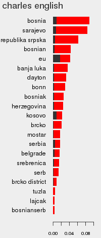
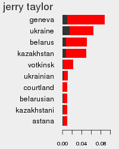
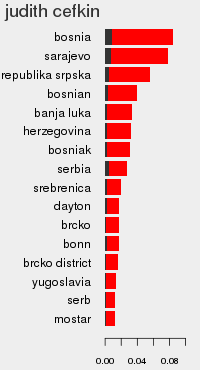
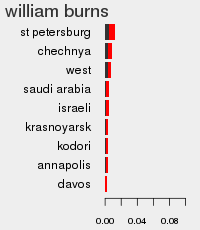
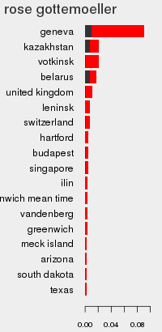
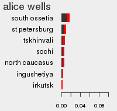
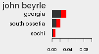
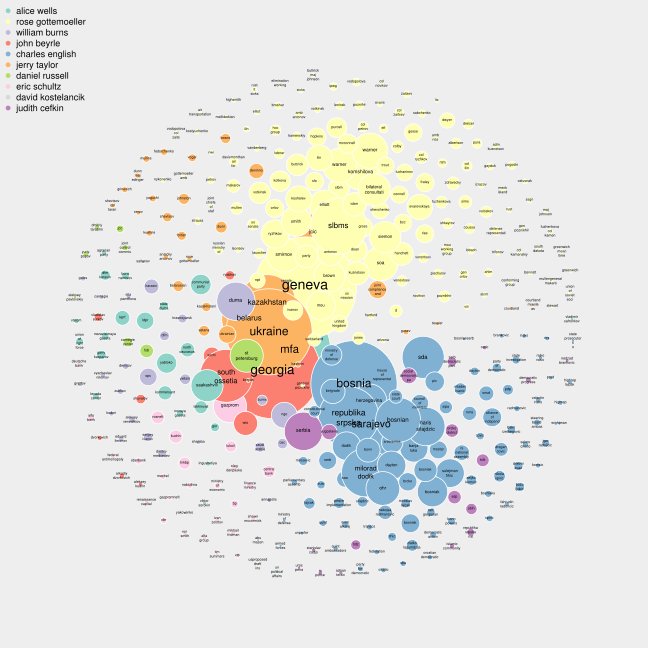

*Meta information on the diplomat classifying each cable reveals many significant dipomat-to-entity associations. Analyzed as a graph, these associations provide a comprehensive view of major agency priorities and their overlap.*

*This post is part #4 in an ongoing series describing data analyses of the Wikileaks cables.*

One of the conveniences of this data is that it follows a structured form with several important pieces of meta-information:

* Send date (which we've looked at previously)
* Subject.
* Origin and destination (surprisingly unimportant, with cables typically originating from a US Mission in the host country and destined for general federal departments)
* TAGS (very generally describing the cable contents, e.g. "External Political Relations", "Military and Defense Arrangements", etc.)
* Classification status.

An ignored data point (as far as I am aware) has been the classification status, which includes a sentence stating the person who classified it and the formal reasons. The [reasons themselves](http://en.wikipedia.org/wiki/Classified_information_in_the_United_States#Classification_categories) are  general, but the diplomat setting the classification essentially takes ownership of the cable. They may not be the original author (as cables are often drafted by lower-level diplomats) but they are the last person in charge once the cable leaves it's origin. Looking for patterns across these individuals can provide insights into the structure of embassy work and the distribution of labour. And unlike assumption-free analysis of the text, these patterns represent priorities set by the department _itself_. Instead of guessing what content was deemed important, we can learn these priorities directly. Which entities are most discussed by individuals within the department? Do they tend to work together or focus on topics individually? Which topics had focus and when? With the classification data, these questions can now be tested directly.

**Individual associations**

Perhaps one of the oldest statistical [tests](http://en.wikipedia.org/wiki/Student's_t-test) evaluates differences between two sets of data, or an _association_ between an indicator and an outcome. We can apply such techniques to this data in looking for an association between classifiers and specific topics. As with any fundamental question, there are dozens of ways to answer it, but to start I simply counted the fraction of times an entity (say "Bosnia") is mentioned by a specific classifier and compared it to the fraction in the rest of the classified data. If the classifier mentioned Bosnia much more or less than everyone else, we can assess the significance of this deviation. Since we're working with small count data, the Fisher's Exact Test is appropriate in evaluating significance. This way, every classifier was tested against every entity they classified, and the final outcome was [corrected](http://en.wikipedia.org/wiki/Bonferroni_correction) for all the tests performed to make sure we weren't just pulling out random patterns because we rolled the dice so many times.

Turns out the data is highly structured, and the top ten classifiers (which had >100 cables each) all strongly associated with many terms. Below is the set of significant associations for the LOCATION category:

 | | |
--- | --- | ---
  |      |   

The red bar corresponds to the fraction of mentions received by that entity, and the black bar is the fraction in the rest of the data. These associations are not just significant, but are also very strong in absolute terms; almost every diplomat has a topic that they discuss _much_ more than the rest. Looking for relationships between the entities, we can guess at some broad topics: Charles English & Judith Cefkin focus on Bosnia, Serbia, and Yugoslavia; Jerry Taylor on Ukraine and Belarus; Eric Schultz on the south-stream pipeline route spearheaded by Gazprom, with construction starting in Krasnoyarsk; etc.

The overall departmental structure appears to be fairly divided, with one or two individuals focusing on each of these topics. Looking at all the topics together also fleshes out the general shape of the Russian conversation. Topics that we had previously guessed as important - Georgia, Bosnia - are now confirmed as important for specific high-level individuals, and others - such as Russian oil resources - are now on the radar.

**From associations to relationships**

Going beyond the individual diplomat-entity associations, we can try to visualize all of these relationships together by placing them in a graph (you knew this was coming, right? At least it's not one of those animated, spring-loaded nightmares. But be sure to zoom in for detail):

So what's going on here? Each node represents an entity (PERSON, LOCATION, or ORGANIZATION), and every pair of nodes has an edge weight corresponding to the number of cables they both appear in. Nodes that never appear together have a weight of zero, and so on. To preserve our sanity, only those nodes that were significantly positively associated with at least one diplomat have been plotted here, and their colours correspond to the most associated diplomat. This is expected to create a distortion in the graph, since we're selecting precisely those entities that are polarizing, but that's actually _desireable_. We're specifically interested in identifying strata which correlate with individual diplomats, and so letting the associated nodes drive the graph structure encourages this. Nodes are also scaled according to their PageRank, which basically measures how many other large nodes each node is connected to. Finally, after everything is laid out the edges are hidden for clarity (as is often the case, they're [pretty](graph.edges.png) but mostly meaningless; the one useful observation is that the neighbouring Gottemoeller and English nodes are mostly independent). I'll add a caveat that many of the attractive qualities (the spherical shape, the spacing between nodes) are an artefact of the layout algorithm, so one should be careful not to draw conclusions like "_diplomatic communications are naturally geometrically circular_" or some-such.

That said, the final network is highly informative and crystallizes our previous term-based guesses. A small number of primary groups are clearly visible:

* Rose Gottemoeller: New START; Geneva (the site of the negotiations); SLBMS (ballistic missiles); NPT (non-proliferation treaty); and various Russian and US negotiators.
* Charles English: Serb/Bosnian relations; Miloard Dodik, the president of Republika Srpska; SDA (The Bosnian Party of Democratic Action); and Srebrenica. There is also strong overlap with diplomat Judith Cefkin.
* Jerry Taylor: Ukraine, Kazakhstan, and Belarus; apparently strong overlap with the Gottemoeller/New START work (through the JCIC - Joint Compliance and Inspection Commission).
* Eric Schultz: finance and natural resources, focusing on Gazprom and Lukoil.
* John Beyrle & Alice Wells: the Georgian war. With Wells focusing on Russian media (the newspapers Kommersant, Novaya Gazeta, Nezavisimaya Gazeta); reform movements (Kasparov, Nemtsov, the progressive Yabloko and Union of Right Forces parties) and hard-liners (far-right LDPR, communist KPRF parties).

As we suspected most, cables focus on topics related to New START negotiations, the Orange Revolution in Ukraine, Bosnian statehood, and the Georgian war; and each topic is helmed by one or two diplomats. Now that the overall layout is understandable to us, we can add in the time dimension and see how nodes have changed through the 2006-2010 period. The [animated graph](time_graph.gif) (warning, large-ish file) reveals additional trends: a persistent focus on the Bosnian issue; the late-2009/early-2010 focus on New START and missile defense; near-total focus on the Georgian war in 08/2008, with little fore-warning; an initial focus on natural resources and Moscow politics that nearly disappears by 2010.

**Graph or trap?**

I'll admit that I've dreaded looking at the data in this massive graph form. Such visualizations tend to be extremely attractive and carry the _appearence_ of information, but often confuse more than they inform. Usually, the viewer is awed by the complexity of the data and then moves on with their day. Perhaps they see a few clusters or over-represented colours and think "_This data sure is complex. But it's also structured._", having learned no more than what could be presented by a handful of statistics. That may be even worse.

To make sure we're not just being seduced by [hairballs](http://eagereyes.org/techniques/graphs-hairball) it's useful to think about how much more information we've _really_ gained over looking at the data in sorted tables. The main contribution of the graph is in summarizing the proximity of terms. For example, many seemingly general terms  - elliott, smith, gross, dean - now come out as corresponding to the New START negotiations. Distance is also revealed: we see that Diplomat Wells focuses both on topics relating to the Georgia war (sakkashvili, tskhinvali) as well as unrelated issues such as Russian newspapers. Lastly, we can get a sense of the complexity of each topic: the Georgian issue is driven by a handful of major entities; while New START includes many equally represented individuals and concepts; and Bosnian statehood is somewhere in between.
