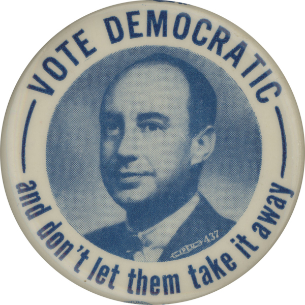
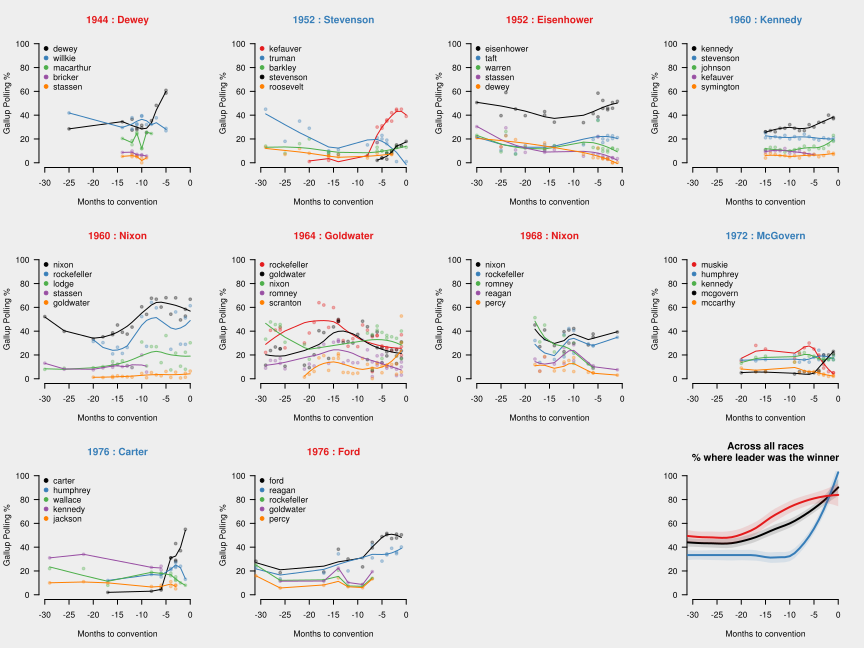
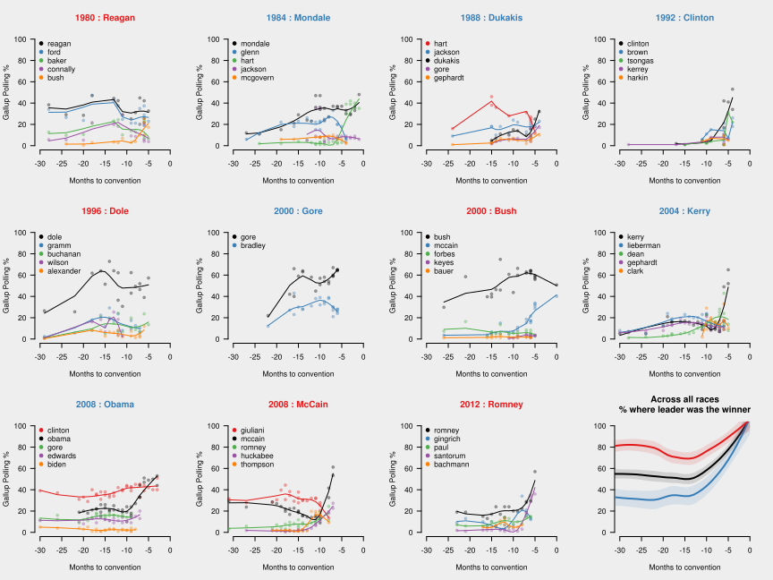

Early primary polls have been getting a lot of attention as the GOP race enters the debate stage. Or, more precisely, they've been getting attention as the GOP embarks on it's decennial ritual where a member of the Bush clan is forced to run for president while being harassed by a self-funded billionaire who has "MAKE 'EM THINK YOU'RE CRAZY!" right in the center of his vision board (no, not [that one](https://en.wikipedia.org/wiki/Ross_Perot), or [that one](https://en.wikipedia.org/wiki/Steve_Forbes)). This year, the network hosting the opening debates even went so far as to use early polling to determine what kind of airtime and stage formation a candidate would receive. But the value of such polls remains in contention, with political scientists furrowing their brows and demanding that we [ignore early polls entirely](http://www.bloombergview.com/articles/2014-12-16/poll-surges-for-2016-candidates-dont-mean-much), while political journalists [complain](http://www.washingtonpost.com/blogs/monkey-cage/wp/2015/07/27/early-polls-dont-mean-much-its-still-possible-to-report-on-them/) that the geeks are ruining all the fun and compare poll skepticism to a sports fan only wanting to watch the last 2 minutes of a sporting event. I'll pause here to note that the sports analogy pretty much misses the point: if only the last two minutes of a sporting event were predictive of outcome, then it would indeed be bad journalism to write long think-pieces about how the team leading the second quarter (or period or whatever) is slated for a historic victory that will reshape sports forever. One can still write about the strategies the two teams are using; the performance of certain key players relative to previous games; the refereeing; or even the fan response; but if the current score has no relationship to the final score, then no amount of enthusiastic analysis is going to make it useful. So the question is, how meaningful are early polls?

Unsurprisingly, the geeks have data on their side. At least one [study](http://themonkeycage.org/2011/05/do-early-polls-predict-anything/) has demonstrated that general election polls >1 year away are complete un-predictive of eventual outcome. A similar [analysis](http://fivethirtyeight.com/features/theres-no-perfect-way-to-sort-the-candidates-for-a-primary-debate/) of February-July primary polling shows this to be the case in party nominations as well. However, while looking at the variance in outcome that can be explained by early polling is statistically sound, it can yield an overly pessimistic result by giving equal weight to minor candidates. Does it really matter that the polls got Huckabee and Santorum wrong if they still got Romney right? What we care about is the winner, so the most basic metric is how often the front-runner in early polls predicts the eventual winner. I don't believe this has been looked at in detail, and I've quantified it here using historical polling data for 21 primaries.

### Early polls in the legacy primary era - not great

<figure class="right">

<figcaption>*Stevenson '52 campaign pin: gets right to the point*</figcaption>
</figure>

Since we're looking at primaries, it's important to consider the major shift in primary structure that happened in the 1970's. The two parties moved from a selection contest lead by party bosses to a large number of binding state-based votes. The states in turn tried to maximize their influence by organizing into regional blocks or vying for earlier elections. To give you an idea of how different the world was, the eventual winner of the 1952 primary didn't even run until the convention! Illinois Governor Adlai Stevenson II was encouraged by many party leaders (including President Truman) to run in the primary but repeatedly declined. At the convention, which was held in his state, his welcome address was so well-received that the party bosses were able to convince him to enter his name into the selection process. Though initially scoring well below the front-runner Estes Kefauver (who had >40% in the popular polls at the time), Stevenson went on to win the nomination after two run-off votes. Stevenson essentially received the presidential nomination with zero public campaigning. In the modern era, this would be like Barack Obama getting the 2004 nomination because he gave a pretty good speech to lead off the convention (but I guess that Obama fellow did alright anyway).

Below are the results from races in the pre-1980's era. The top five performers (which always included the front-runners and the winners) are shown from each race, with the eventual winner plotted in black. The figures are ordered chronologically, and each one starts 30 months prior to the party convention, where the nominee is selected, and move towards the convention as you go from left to right. Individual poll results are shown as points and also locally smoothed into trendlines. Finally, the overall trend is shown in the bottom-right and also broken down by party (Red Republicans and Blue Democrats).

<figure class="full">

<figcaption>*Primary polling trends from the pre-1980 era*: Polls become more predictive than initial standings at -20 months (R) and -10 months (D).</figcaption>
</figure>

Overall, the polls show a steady increase in predictability starting at about -15 months and hitting 80% (my completely arbitrary threshold for "good") at -5 months. Notably for Democrats, out of four races only John F. Kennedy was both initial front-runner and winner. Aside from Eisenhower and Kennedy, the races were surprisingly contentious, with the winners closely trailed by their competition throughout the race.

### Early polls in the modern primary era - also not great

With the the modern primary era shifting power away from the party bosses and to the states, we might expect the races to get more "democratic" and polling (which has also improved in rigor over time) to become more predictive. Below are the results from races in the post-1980's era.

<figure class="full">

<figcaption>*Primary polling trends from the post-1980 era*: Polls become more predictive at -5 months (R) and -10 months (D).</figcaption>
</figure>

Let's focus on the general trends by party. Even though Democrats ushered in the state-oriented primary, the trend for them actually changed very little. Democratic voters tend to pick the wrong guy more often than not until about -10 months, at which point the polling quickly moves to the eventual winner. For Republicans the modern trend is a bit more interesting. First, the initial front-runner became much more favored to win the nomination, from 50% of the time in the legacy era to 80% of the time now. Even in the one election where the front-runner was not the winner (2008, with McCain lagging but eventually overtaking Giuliani) the two started out in a statistical tie. Second, the Republican polls actually appear to get *worse* than initial polls in the -20 to -5 months period, primarily driven by the false waves of 2008/2012. The monthly polling interval actually understates this dip for the [2012 primary](http://elections.huffingtonpost.com/pollster/2012-national-gop-primary), where almost every candidate was temporarily front-runner. If these last two races are the start of a pattern, we should be especially skeptical of polls in this time-frame, particularly when they differ greatly from the initial front-runner.

### Conclusions

The results from the modern era seem to contradict themselves. On the one hand, early polling is quite predictive of eventual outcome, at least for Republicans. On the other hand, the predictiveness stagnates for months and even gets less predictive for a time until ~5 months prior to the convention. Both of these statements are true and thus allow for the philosophical gap between political scientists and journalists to persist.

Returning like a dog to it's vomit to the sports metaphor, imagine that professional basketball games now have a half-time dunk contest between the players. This shoot-out is weakly predictive of what will happen in the second half - for example, players that tripped and fell during their dunk were likely to do poorly later in the game - but it's much less predictive than the actual score from the first half. And now imagine that sports journalists spent an inordinate amount of time discussing the dunk contest and what it meant for the second half; reviewed dunks in slow-motion; comparing dunk performance to historic trends; etc. All at the cost of actually interviewing coaches about their strategies or consulting with experts about that first-half fundamentals were important. The side-show has become the main event.

In general, I think it's hard to appreciate the fact that that how the public feels now is actually *less* representative of the future than how they felt yesterday. We tend to think of voters as a machine that slowly becomes more informed as it converges on the preferred candidate. And that "meaningless" -20 to -5 month period contains a ton of data - rallies, multiple debates, press-conferences. But in recent history Republican voters actually make up their mind early on, then grope in the dark for other plausible candidates, and finally accept the one they chose from the beginning. While Democrats grope around the whole way through. For a journalist to accept the futility of daily poll fluctuations during this period would also mean accepting, at least in part, the pointlessness of their own their reporting in guiding the public to their eventual decision.

So what does this mean for the 2016 primary? For Democrats, it means that Hillary Clinton's lead is not assured, and  that a repeat of 2008 is still entirely possible. For Republicans, it means Mike Huckabee - who lead in Jan 2014 - is certainly going to be the next nominee. No but seriously, it means that the groping in the dark period now extends even further back than before, and Jeb Bush - the only candidate that has held a consistent baseline of support - is likely to be the eventual winner. For us, it means to ignore those polls until the start of 2016. With more polling data, it would be interesting to breakdown the electorate into key demographics and see if any are particularly good at picking the eventual winner.

### Appendix: Data details

*Some amount of data massaging was required to get everything working without having to read through thousands of individual poll questions. I downloaded all polls from Gallup that contained the text "Republican candidate for president" or "Republican nomination for president" (likewise for Democrats) and tried to exclude as many "second choice" or leaner answers as I could find. Races that did not have at least 12 polls were excluded. For each race, candidates that were not queried in >50% of the polls were excluded. Of the remaining candidates, the top five by average poll % were plotted, with the eventual winner always shown in black. Though the Gallup archive primarily had monthly polling, polls that were taken in in the same month were plotted separately (and therefore averaged in the fit curve). For the average across all races, the first and last poll results were extended backward/forward to 30 months, and races that did not have a poll in a given month were interpolated from the previous month. In all plots smoothing was done by simple LOESS curve fitting.*